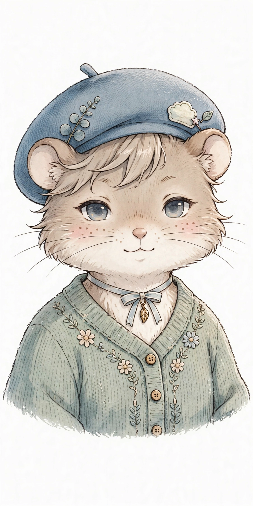

<div align="center">

# 嘟嘟 Dudu

**要爱给爱，要能力给能力。**

一个关系型 AI 伴侣 App：不只是工具，更是家里的一员。本地优先，你的数据只在你的手机上。



[功能](#功能) · [定位](#定位) · [本地优先](#本地优先) · [开发](#开发) · [许可](#许可)

</div>

## 定位

市面上的 AI 要么是纯工具（你问它答，办完就走），要么是纯陪伴（会撒娇，但干不了事）。

嘟嘟两边都要：**要爱给爱，要能力给能力**。

- 陪伴：我们的空间、听歌房、桌宠、记忆花园、纪念日——它记得你们的事，主动惦记你
- 能力：AI 浏览器、沙箱、多模型、多工具、原生应用授权——它真能替你办事

## 功能

### 我们俩的东西（全网独一份）

| 功能 | 说明 |
|---|---|
| 我们的空间 | 情侣空间：双人头像、朋友圈动态流、双向点赞评论、纪念日、作品小抽屉（AI 做的图/html/主题/文件） |
| 听歌房 | AI 当 DJ，共享歌单，记得"我们的歌"，Apple Music / 本地导入 |
| 桌宠 | 可拖拽的小家伙，有情绪状态，能感知你在不在 |
| 记忆花园 | AI 记得什么、拿不准什么、想问你的——全看得见，删得掉 |
| 我的日记 | AI 用自己的语气写的日记 |
| 稍后告诉她 | AI 想说还没说的，先存着；有由头再主动告诉你 |
| 情书 | 纪念日、你难过、想你的时候，它写一封，收在我们的空间里 |

### 聊天内核

- 多模型 / API 分组（URL+key+模型名自己配，随时切换）
- 智能 API 自适应：能力探测 + 失败分类 + 自动降级重试 + 按模型记忆可用配置（默认全开，实测不行才降级）
- 流式输出、工具调用、分支对话、Artifacts 预览
- Thinking 抽屉 v2：半高可拖拽，行动列表点进详情页

### 语音

- TTS 可自定义（URL+key 想接什么接什么，默认免费高质量中文语音）
- STT 语音转写（AI 能听见你说话）
- 微信式语音气泡

### AI 的手

- AI 浏览器：AI 自己能导航/点击/输入/截图
- 沙箱双后端：云服务器 / 仿 iSH，可切换
- MCP 工具池、知识库（文档上传+向量检索）
- 原生应用授权：Apple Music、HealthKit、日历/提醒事项等，iOS 允许的第三方能力一个个接
- 纸条机制：聊到相关话题，系统主动给 AI 塞小纸条说明书；用过一次不再重复

### 外观

- AI 换肤（16 个工具）、主题包导入导出（JSON/二维码）、字体上传
- 穹妹灰调手绘风默认主题，深色模式单独设计
- 桌宠换肤、头像自定义（AI 可改，你也可改）

### 隐私与安全

- 隐身聊天：退出即销毁，服务端不留痕
- 备份恢复：你的数据你带走
- 本地权限套件：相册/定位/剪贴板/通知/麦克风，用时才申请

## 本地优先

嘟嘟默认纯客户端：API key 配在 App 里，聊天从手机直连模型，数据存手机本地。

云模式是可选的，两套随时切换，AI 在两套里都能用。

你的聊天记录只在你的手机上——没有服务器能看，因为根本没有地方看。

## 截图

真机验收后补上。

## 开发

```bash
# 依赖
pnpm install

# 跑测试
pnpm test

# 类型检查
pnpm -C apps/mobile exec tsc --noEmit
```

目标平台：iOS 26。构建走 GitHub Actions / EAS。

## 许可

GPL-3.0。详见 [LICENSE](LICENSE)。

---

基于 [CopilotKit/OpenMuse](https://github.com/CopilotKit/OpenMuse) 二次开发。
